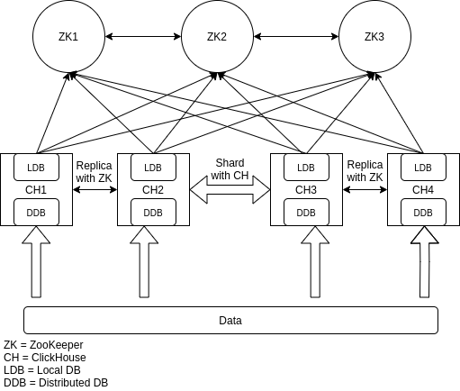

# Clickhouse Replica Sharding (2 Shards, 2 Replicates)  
  
### Host  
Three Apache ZooKeeper hosts : ZK1 ZK2 ZK3  
Four Clickhouse hosts : CH1 CH2 CH3 CH4  
### Install Apache ZooKeeper  
First install Java 8  
```yum install java-1.8.0-openjdk```  
Then Install Apache ZooKeeper  
```bash
groupadd zookeeper
useradd -g zookeeper -d /opt/zookeeper -s /sbin/nologin zookeeper
wget http://mirrors.ukfast.co.uk/sites/ftp.apache.org/zookeeper/zookeeper-3.4.10/zookeeper-3.4.10.tar.gz
mv zookeeper-3.4.10.tar.gz /opt
cd /opt
tar xzf zookeeper-3.4.10.tar.gz
ln -s zookeeper-3.4.10 ./zookeeper
cd zookeeper
mkdir data
chown -R zookeeper:zookeeper /opt/zookeeper/*
```  
Edit ```/opt/zookeeper/conf/zoo.cfg``` file:  
```vim
tickTime=2000
initLimit=10
syncLimit=5
dataDir=/tmp/zookeeper
clientPort=2181
server.1=zk1:2888:3888
server.2=zk2:2888:3888
server.3=zk3:2888:3888
```  
Test ZooKeepers:  
```bash
/opt/zookeeper/bin/zkServer.sh start
```  
Connect to ZooKeeper:  
```bash
/opt/zookeeper/bin/zkCli.sh -server zk1
```  
Create PATH for test:  
```bash
CREATE /test
```  
Check other ZooKeepers to create /test PATH:  
```bsah
/opt/zookeeper/bin/zkCli.sh -server zk2
ls /
```
Output:  
```bash
/zookeeper
/test
```  
Delete /test PATH for check multi master ZooKeeper  
```bash
DELETE /test
```  
Connect to another ZooKeeper:  
```bash
/opt/zookeeper/bin/zkCli.sh -server zk3
ls /
```
Output:  
```bash
/zookeeper
```  
Fine ZooKeeper works well  
And create systemd service:  
Create ```/usr/lib/systemd/system/zookeeper.service``` file:  
```vim
[Unit]
Description=Zookeeper Service

[Service]
Type=simple
WorkingDirectory=/opt/zookeeper/
PIDFile=/opt/zookeeper/data/zookeeper_server.pid
SyslogIdentifier=zookeeper
User=zookeeper
Group=zookeeper
ExecStart=/opt/zookeeper/bin/zkServer.sh start
ExecStop=/opt/zookeeper/bin/zkServer.sh stop
Restart=always
TimeoutSec=20
SuccessExitStatus=130 143
Restart=on-failure

[Install]
WantedBy=multi-user.target
```  
Start services:  
```bash
systemctl daemon-reload
systemctl enable zookeeper.service
systemctl start zookeeper.service
```  
Cluster ZooKeeper nodes:  
Create ```myid``` file in ```/data/``` on each nodes and add number in files:  
```bash
myid node 1
1

myid node 2
2

myid node 3
3
```  
Then restart ZooKeepers services.  
### Install Clickhouse  
```bash
curl -s https://packagecloud.io/install/repositories/altinity/clickhouse/script.rpm.sh | sudo bash
yum install -y clickhouse-server clickhouse-client
systemctl start clickhouse-server
systemctl enable clickhouse-server
```  
Now replace your custom changes on ```config.xml``` file in ```/etc/clickhouse-server/``` directory.  
```xml
<remote_servers>
    <ShardedAndReplicated>
        <shard>
            <internal_replication>true</internal_replication>
            <replica><host>ch1</host><port>9000</port></replica>
            <replica><host>ch2</host><port>9000</port></replica>
        </shard>
        <shard>
            <internal_replication>true</internal_replication>
            <replica><host>ch3</host><port>9000</port></replica>
            <replica><host>ch4</host><port>9000</port></replica>
        </shard>
    </ShardedAndReplicated>
</remote_servers>
```  
Internal replication tag replicate with Zookeeper between two replica host set in shard section.  
Define ZooKeeper's address:  
```xml
<zookeeper>
    <node><host>zk1</host><port>2181</port></node>
    <node><host>zk2</host><port>2181</port></node>
    <node><host>zk3</host><port>2181</port></node>
</zookeeper>
```  
And set macros for each node is different cause with this macros info create PATH in ZooKeepers and config replica and sharding system.  
##### CH1
```xml
<macros>
    <shard>01</shard>
    <replica>01</replica>
</macros>
```  
##### CH2
```xml
<macros>
    <shard>01</shard>
    <replica>02</replica>
</macros>
```  
##### CH3
```xml
<macros>
    <shard>02</shard>
    <replica>01</replica>
</macros>
```  
##### CH4
```xml
<macros>
    <shard>02</shard>
    <replica>02</replica>
</macros>
```  
Now restart Clickhouse nodes.  
### Clickhouse cluster  
Connect to Clickhouse client:  
```bash
clickhouse-client -h ch1
```
And check the cluster is running:  
```sql
select * from system.clusters
```
Now create table for LDB:  
```sql
CREATE TABLE local ON CLUSTER ShardedAndReplicated (
    EventDate DateTime, CounterID UInt32, UserID UInt32)
ENGINE = ReplicatedMergeTree('/clickhouse/ShardedAndReplicated/tables/local/{shard}','{replica}')
PARTITION BY toYYYYMM(EventDate)
ORDER BY (CounterID, EventDate, intHash32(UserID));
```  
check each node to confirm DB is create.
now create distributed DB:  
```sql
CREATE TABLE events ON CLUSTER ShardedAndReplicated
AS local
ENGINE = Distributed('ShardedAndReplicated','default','local',rand());
```  
now check with insert data in db:  
```sql
INSERT INTO events(EventDate, CounterID, UserID) VALUES (now(),1,2),(now(),2,2);
```
```sql
select * from events;
```
Turn of the nodes and insert data in events db then recheck the data.

